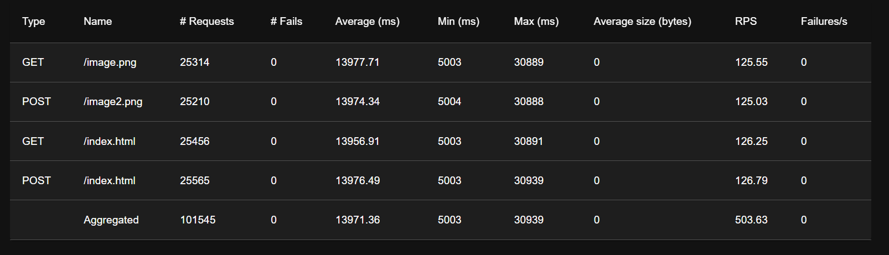
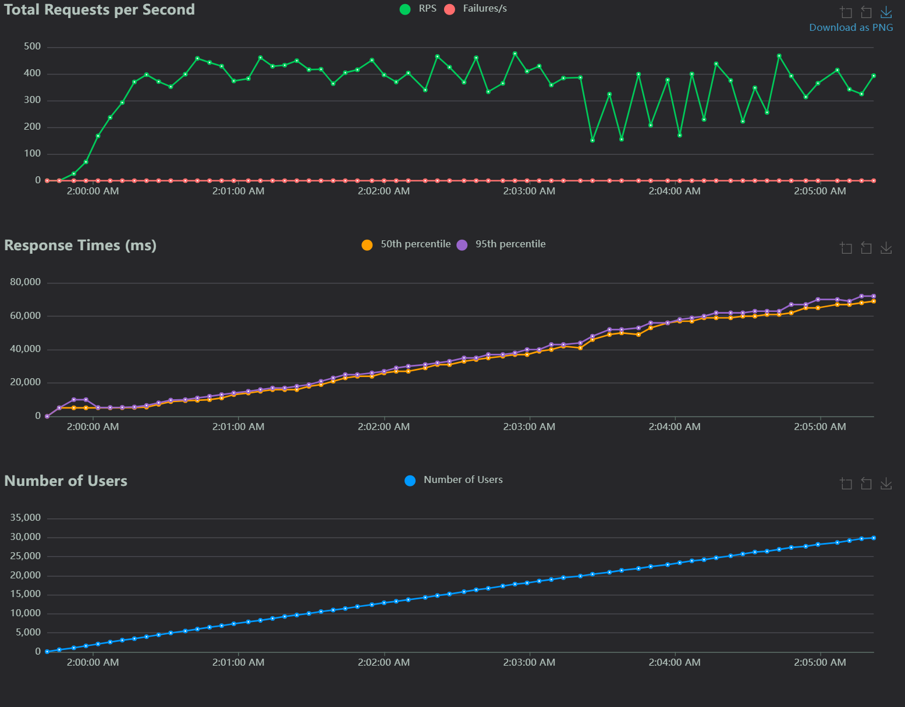

# Client-Server Application

## Overview

This application consists of a server and a client that communicate using HTTP-like GET and POST requests to support file transfers. The server manages requests from multiple clients, allowing them to:

- Download files (GET request)
- Upload files (POST request)

## Features

- **File Retrieval (GET):** Download files from the server by specifying the file path.
- **File Upload (POST):** Upload files to the server by specifying the file path and content
- **Command Execution from File**: The client can execute multiple commands sequentially from a specified file.

## Requirements

- Python 3
- Standard libraries: `socket`, `threading`, `os`, `sys`, and `time`

## Installation

 Clone the repository

```bash
git clone https://github.com/AbdElRahmanOsama182/SocketProgramming.git
cd SocketProgramming
```

## Usage

### Starting the Server

Run the server by specifying a port as an argument:

```bash
cd server
./my_server.py <PORT>
```

### Running a Client

The client requires a command file and the server's IP address to connect. Optionally, a port can also be specified (the default is 80).

**Command File Format**

The command file should contain one command per line, structured as follows:

```
client_get example.txt 192.168.1.10 8080
client_post upload.txt 192.168.1.10 8080
```

**Execute Commands**

Run the client with the command file and server IP:

```bash
cd client
./my_client.py commands.txt <server_ip> <port>
```

## Adjusting Time

Dynamically adjusts the timeout based on the current number of active client connections, that as more clients connect, the timeout becomes shorter to free up resources more efficiently

```python
def adjust_timeout():
    connections = threading.active_count() - 1
    factor = math.ceil(math.log(connections + 1), 100)
    return IDLE_TIMEOUT / factor
```

## Overall Program Organization

1. **Server**
    - Listens for incoming client connections.
    - Processes incoming HTTP-like requests (GET and POST).
    - Handles file retrieval and upload via GET and POST methods, respectively.
    - It supports persistent connections and adjusts timeouts based on server load.
    - Manages multiple client connections using threads.
    
2. Client
    - Reads commands from a file.
    - Sends HTTP-like requests (GET or POST) to the server based on the commands.
    - Handles file download (GET) and upload (POST).
    - Receives files from the server and stores them locally.
    - Uploads files to the server and confirms success or failure.
    

## Major Functions

### Server Functions

1. **`start_server(port)`**:
    - Initializes the server, binds it to a specific port, and listens for client connections.
    - Accepts incoming connections and spawns a new thread for each client.
2. **`handle_client(conn, addr)`**:
    - Handles communication with an individual client.
    - Processes GET and POST requests.
    - For GET requests, it checks if the requested file exists, reads it, and sends it to the client.
    - For POST requests, it receives the file from the client and saves it to disk.
    - Sets and adjusts timeouts dynamically based on the number of active connections.
3. **`adjust_timeout()`**:
    - Dynamically adjusts the timeout for client connections based on the number of active connections.
    - Uses logarithmic scaling to reduce the timeout as the number of clients increases.

### Client Functions

1. **`client_get(file_path, host, port)`**:
    - Sends a GET request to the server to retrieve a file.
    - If the server responds with a 200 OK status, it saves the file locally.
2. **`client_post(file_path, host, port)`**:
    - Sends a POST request to upload a file to the server.
    - Reads the file data and sends it to the server.
    - Receives a 200 OK response from the server if the upload is successful.
3. **`run_client(commands_file, server_ip, server_port)`**:
    - Reads commands from a file and executes them.
    - Each command specifies the type of request (GET or POST), the file path, the server IP, and optionally the port.
    - Calls `client_get` or `client_post` for each command.

## Test the Server With a Real Web Browser


## Performance Evaluation

### Request Statistics



### Response Time Statistics


### Charts



## Contributors

Abdelrhman Osama Hassan

Abdelrhman Mohamed Deif
